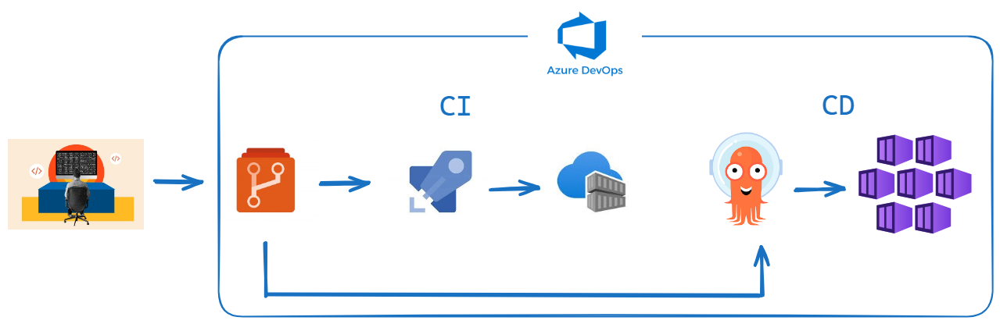

## Deploy microservice application using Azure DevOps and ArgoCD
A simple distributed application running across multiple Docker containers.

## Architecture

* A front-end web app in [Python](/vote) which lets you vote between two options
* A [Redis](https://hub.docker.com/_/redis/) which collects new votes
* A [.NET](/worker/) worker which consumes votes and stores them in…
* A [Postgres](https://hub.docker.com/_/postgres/) database backed by a Docker volume
* A [Node.js](/result) web app which shows the results of the voting in real time

## Project Architecture

